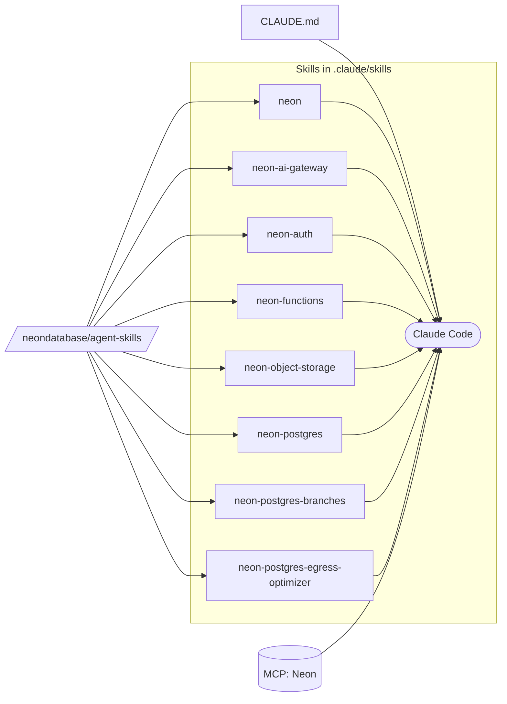

# AI setup

Generated by `uv run tools/ai_diagram.py`. Do not edit by hand.

```mermaid
flowchart LR
    n_claude(["Claude Code"])
    n_claude_md["CLAUDE.md"] --> n_claude
    subgraph skills ["Skills in .claude/skills"]
        n_skill_neon["neon"] --> n_claude
        n_skill_neon_ai_gateway["neon-ai-gateway"] --> n_claude
        n_skill_neon_auth["neon-auth"] --> n_claude
        n_skill_neon_functions["neon-functions"] --> n_claude
        n_skill_neon_object_storage["neon-object-storage"] --> n_claude
        n_skill_neon_postgres["neon-postgres"] --> n_claude
        n_skill_neon_postgres_branches["neon-postgres-branches"] --> n_claude
        n_skill_neon_postgres_egress_optimizer["neon-postgres-egress-optimizer"] --> n_claude
    end
    n_source_neondatabase_agent_skills[/"neondatabase/agent-skills"/]
    n_source_neondatabase_agent_skills --> n_skill_neon
    n_source_neondatabase_agent_skills --> n_skill_neon_ai_gateway
    n_source_neondatabase_agent_skills --> n_skill_neon_auth
    n_source_neondatabase_agent_skills --> n_skill_neon_functions
    n_source_neondatabase_agent_skills --> n_skill_neon_object_storage
    n_source_neondatabase_agent_skills --> n_skill_neon_postgres
    n_source_neondatabase_agent_skills --> n_skill_neon_postgres_branches
    n_source_neondatabase_agent_skills --> n_skill_neon_postgres_egress_optimizer
    n_mcp_Neon[("MCP: Neon")] --> n_claude
```
