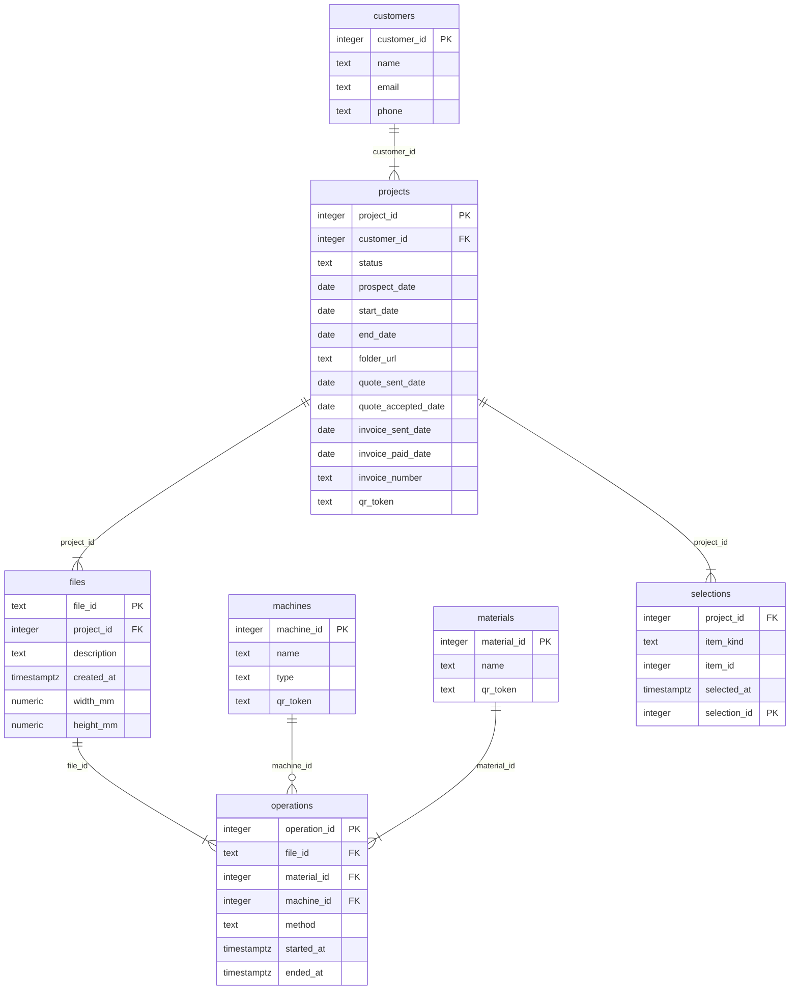

# Database

Generated by `uv run --env-file .env.local tools/db_diagram.py` from the live database. Do not edit by hand.

```mermaid
erDiagram
    customers {
        integer customer_id PK
        text name
        text email
        text phone
    }
    files {
        text file_id PK
        integer project_id FK
        text description
        timestamptz created_at
        numeric width_mm
        numeric height_mm
    }
    machines {
        integer machine_id PK
        text name
        text type
        text qr_token
    }
    materials {
        integer material_id PK
        text name
        text qr_token
    }
    operations {
        integer operation_id PK
        text file_id FK
        integer material_id FK
        integer machine_id FK
        text method
        timestamptz started_at
        timestamptz ended_at
    }
    projects {
        integer project_id PK
        integer customer_id FK
        text status
        date prospect_date
        date start_date
        date end_date
        text folder_url
        date quote_sent_date
        date quote_accepted_date
        date invoice_sent_date
        date invoice_paid_date
        text invoice_number
        text qr_token
    }
    selections {
        integer project_id FK
        text item_kind
        integer item_id
        timestamptz selected_at
        integer selection_id PK
    }
    projects ||--|{ files : project_id
    files ||--|{ operations : file_id
    machines ||--o{ operations : machine_id
    materials ||--|{ operations : material_id
    customers ||--|{ projects : customer_id
    projects ||--|{ selections : project_id
```
